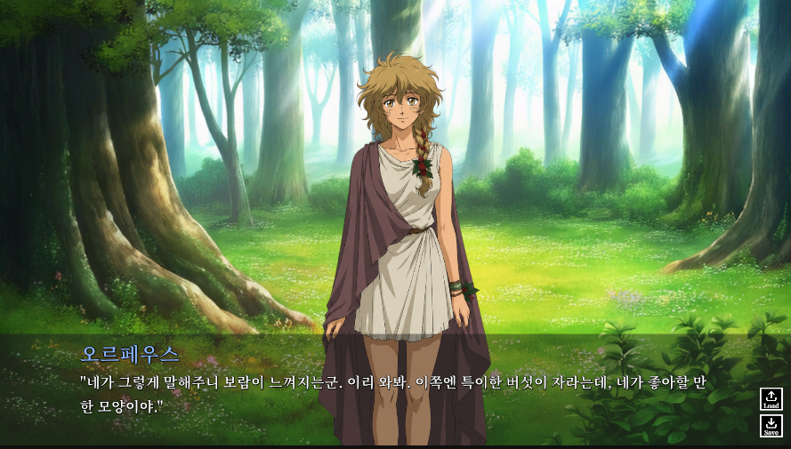

# 🎼 Orpheus Story

> **오르페우스와 에우리디케 신화를 바탕으로 한 2D 비주얼 노벨 프로젝트**  
> 대사, 선택지, 비주얼 이벤트, BGM/SFX, 세이브/로드 시스템을 직접 구현한 Unity 기반 스토리 게임입니다.

---

## 📌 프로젝트 개요

| 항목 | 내용 |
|------|------|
| 장르 | 2D 비주얼 노벨 / 신화 판타지 |
| 플랫폼 | PC |
| 조작 방식 | Keyboard & Mouse |
| 개발 엔진 | Unity |
| 개발 언어 | C# |
| 개발 인원 | 1명 |

---

## 🎮 게임 소개

`Orpheus Story`는 그리스 신화의 오르페우스와 에우리디케 이야기를 기반으로 한 비주얼 노벨입니다.

플레이어는 오르페우스의 여정을 따라가며 숲, 저승 강, 하데스의 궁전 등을 지나고, 중요한 순간마다 선택지를 통해 결말로 이어지는 흐름을 경험합니다.  
대사 진행, 캐릭터와 배경 연출, 선택지 분기, 사운드 전환, 세이브/로드 기능까지 비주얼 노벨에 필요한 핵심 시스템을 직접 구현했습니다.

---

## 🕹 주요 구현 기능

### 대사 시스템

* CSV 기반 챕터별 대사 데이터 관리
* `CsvHelper`를 활용한 대사 로딩 구조 구현
* 대사 ID, 다음 대사 ID, 선택지 키, 비주얼 이벤트 키 연결
* 내레이션과 캐릭터 대사 출력 방식 분리
* 타이핑 효과 및 스킵 입력 처리

### 선택지 시스템

* 선택지 데이터 ScriptableObject 관리
* 선택지 개수에 따른 UI 슬롯 자동 생성
* 버튼 클릭으로 분기 대사 이동
* 선택지 표시 중 일반 대사 입력 차단

### 비주얼 이벤트 시스템

* ScriptableObject 기반 배경, CG, 캐릭터 배치 데이터 관리
* 대사별 배경/캐릭터/CG/효과/사운드 연결
* 캐릭터 등장 페이드인, 퇴장 페이드아웃 처리
* 배경 및 CG 변경 시 전환 연출 적용
* 화면 플래시, 물결 커튼 전환 등 확장 가능한 비주얼 효과 구조 구현

### 비주얼 이벤트 에디터

* Unity EditorWindow 기반 전용 편집 도구 구현
* 대사 이전/다음 이동 및 현재 비주얼 이벤트 미리보기
* 등록된 배경, 캐릭터, CG 팔레트에서 빠른 세팅
* 인스펙터에서 배치값 조정 후 저장하는 제작 흐름 구성
* BGM/SFX 할당 및 미리듣기 기능 구현

### 사운드 시스템

* BGM, SFX, UI 클릭 사운드 재생 구조 구현
* 비주얼 이벤트에 BGM/SFX 연결
* 챕터 전환 시 BGM 정리
* UI 버튼 클릭 사운드 공통 처리

### 세이브 / 로드 시스템

* JSON 기반 세이브 데이터 저장
* 현재 대사 ID, 챕터, 미리보기 텍스트, 저장 시간 저장
* 세이브 시 화면 썸네일 캡처 저장
* 타이틀과 게임 씬에서 공용으로 사용하는 세이브/로드 창 구현
* 로드 전 확인 팝업 처리

### 타이틀 / 씬 흐름

* 새로 시작, 이어하기, 게임 종료 버튼 구성
* 새로 시작 시 첫 대사부터 시작
* 이어하기 시 세이브 슬롯 선택 후 게임 씬 로드
* 게임 씬 내부에서도 세이브/로드 창 호출 가능

---

## 🧩 게임 진행 흐름

```text
타이틀 화면
    ↓
새로 시작 / 이어하기
    ↓
대사 진행
    ↓
비주얼 이벤트 적용
    ↓
선택지 분기
    ↓
엔딩 도달
```

---

## 🖼️ 스크린샷

| 대사 화면 |
|----------|
|  |
---

## 🤖 AI 활용 내역

개발 과정에서 일부 AI 도구를 활용했습니다.

* 대사 시스템, 비주얼 이벤트 구조, 세이브/로드 구조 설계 보조
* 배경, CG, UI 리소스 제작 보조
* BGM 및 SFX 제작을 위한 프롬프트 작성 보조
* README 및 기획 문서 정리 보조

AI가 생성한 결과물은 프로젝트 방향에 맞게 직접 검토하고 수정하여 적용했습니다.

---

## 🔗 링크

* 시연 영상: https://www.youtube.com/watch?v=IFOY2SSLnA8


